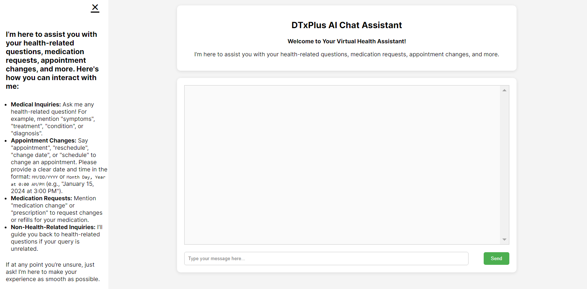
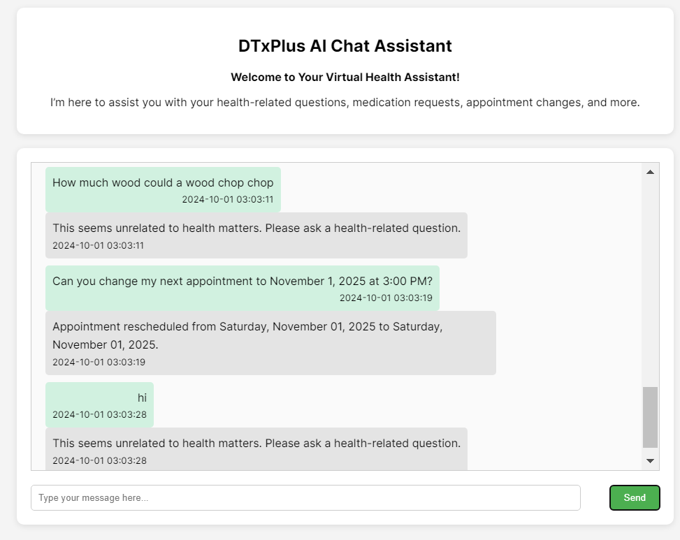
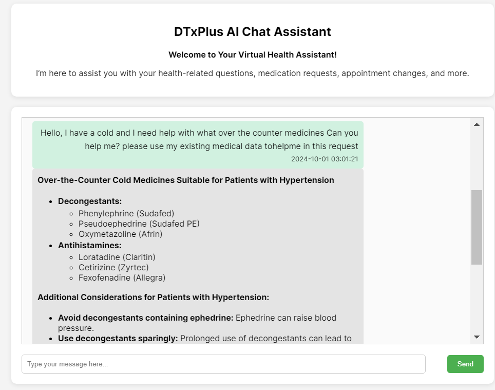
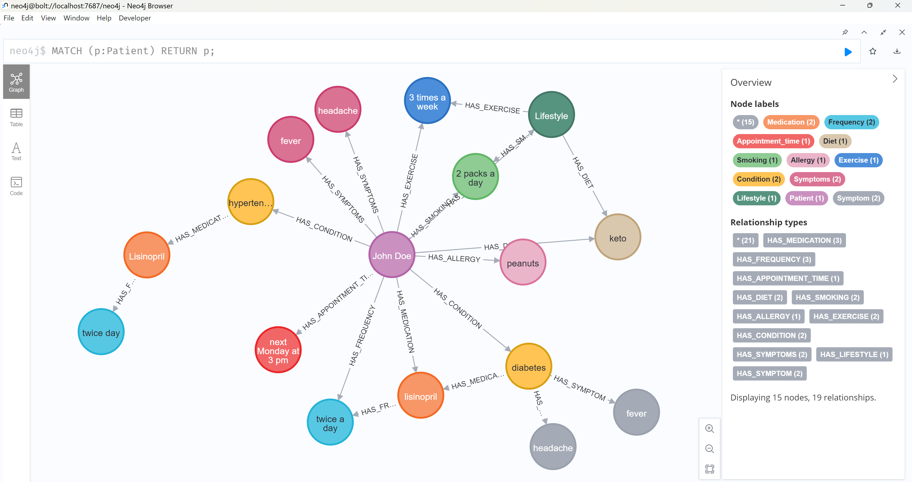

# DTxPlus AI Chat Assistant
## Overview
This project implements a Django-based Patient Chat Application where a patient can interact with an AI bot to manage health-related conversations, request changes to appointments, medications, and access important medical information. It uses a knowledge graph and an LLM agnostic design to enhance the functionality and scalability of the application. Additional information for the user's benefit is included in the "Info" sidebar on the left of the main page, a preview is in the picture below:



## Key Features
**Health-Related Conversations**: The bot assists the patient by answering queries related to medical conditions, medications, diet, and appointments.
**Appointment Requests**: Patients can reschedule appointments, and the bot will update the request for the doctor. Example: 
**Entity Extraction**: The bot extracts key entities (e.g., medications, appointment preferences, symptoms) from the conversation and stores them in a Neo4j knowledge graph for dynamic use in subsequent conversations. Example in image, where chat pulls information about patient from knowledge graph: 
**Memory Optimization**: The bot manages long conversations by optimizing memory stored in the knowledge graph and in the PostgreSQL database. Currently I did not utilize memory from LangChain, rather memory was implemented across the 2 databases so these handle memory thoroughly with advanced querying, and memory is stored across sessions. Memory is stored asynchronously in real-time for quicker processing.
**LLM Agnostic Design**: This project was implemented using Google’s Gemini model via the Langchain framework. However, the system is designed to be agnostic to the LLM in use. This means that other models, such as GPT-3, LLaMA, or any healthcare-focused models, can be easily integrated. The chatbot’s architecture is flexible, allowing for seamless switching between different models to suit various use cases.

## Details about Machine Learning Deployments in this Repository
- **Classifier for Query Filtering**: The chatbot utilizes a binary classifier trained on 2 QA datasets, **MedQuAD** for health-related queries and **Natural Questions** for non-health-related queries; in addition, a topic model from HuggingFace was also used (**etanios/short-pubmed-bertopic**) in order to filter out non-health related prompts with minimal leakage, as well as **alt-profanity-check** to limit profanity and unwanted subjects.
- **Entity Extraction for Knowledge Graph**: Entities such as medications, symptoms, and appointment preferences are extracted from user inputs using **Bio_ClinicalBERT** and regex matching. These entities are stored in a **Neo4j Knowledge Graph** to persist patient data for future conversations.

## Setup Notes
- **Google Gemini API**: Setting up the Google Gemini API required enabling the `generativelanguage.googleapis.com` on Google Cloud Console and downloading an API key, which is loaded as an environment variable for the application.
- **Database Setup**: PostgreSQL was used to store patient chat data, while Neo4j was used for the knowledge graph. Both of these databases will need to be set up locally or via a cloud provider.

### Bonus Features Implemented:
**Knowledge Graph Integration**: The extracted information, such as medications and appointment preferences, is stored in Neo4j for use in future interactions. Example image: 
**LLM Agnostic**: The system is designed to switch LLMs seamlessly, using Langchain to handle model-agnostic interactions.

## Project Structure
```bash
├── datasets                    # Datasets used for any additional data processing or experiments
├── patient_chat_app            # Main Django app
│   ├── chatbot                 # Bot logic, including services, views, and templates
│   ├── ml_models               # Folder to store any machine learning models used
│   ├── static                  # Static files (CSS, JS, etc.)
│   └── templates               # HTML templates for the chat interface
└── venv                        # Virtual environment (not included in the repository)
```
## Setup Instructions

1. Clone the Repository
```bash
git clone https://github.com/your-repository-url/patient-chat-app.git
cd patient-chat-app
```
2. Set Up a Virtual Environment (Recommended)
```bash
python -m venv venv
source venv/bin/activate  # On Windows: venv\Scripts\activate
```
3. Install Required Dependencies
Install the Python dependencies listed in requirements.txt:
```bash
pip install -r requirements.txt
```

4. Set Up PostgreSQL Database
Install PostgreSQL and create a database:

```sql
CREATE DATABASE patient_chat;
```
In the settings.py file, update the database configuration:
```python
DATABASES = {
    'default': {
        'ENGINE': 'django.db.backends.postgresql',
        'NAME': 'patient_chat',
        'USER': 'your-username',
        'PASSWORD': 'your-password',
        'HOST': 'localhost',
        'PORT': '5432',
    }
}
```
5. Set Up Neo4j Database
Install and set up Neo4j:
Download from neo4j.com
Set up a local instance with default configurations.
Once Neo4j is running, update your knowledge_graph.py with your Neo4j connection credentials in the knowledge_graph.py file:
```python
uri = "bolt://localhost:7687"
user = "neo4j"
password = "your-password"
```

6. Gemini LLM Integration
To use Gemini as your LLM model:

Obtain an API key from AI Studio.
Store the key in gemini_api_key.json and load it as an environment variable:
```bash
export GOOGLE_APPLICATION_CREDENTIALS="path/to/gemini_api_key.json"
```
7. Run Database Migrations
Run migrations to set up your PostgreSQL database:

```bash
python manage.py makemigrations
python manage.py migrate
```
8. Run the Application
```bash
python manage.py runserver
```
Access the app by navigating to http://127.0.0.1:8000/ in your browser.

9. Environmental Variables
The following environmental variables need to be set for the project to work correctly:

NEO4J_URI: The URI of your Neo4j database (e.g., bolt://localhost:7687)
NEO4J_USER: Your Neo4j username
NEO4J_PASSWORD: Your Neo4j password
GOOGLE_API_KEY: API key for using Google Gemini or other models via Langchain.

## Usage
Once the application is running:

**Patient Interaction**: Type queries in the chat interface to ask questions about health, medication, or appointments.
**Appointment Changes**: Use commands like "reschedule my appointment" to trigger appointment changes.
**Knowledge Graph**: The bot dynamically queries the Neo4j knowledge graph to recall and store patient-related data.

## Assumptions
The project assumes a single patient interacting with the bot, and the patient details can be stored in a PostgreSQL database.
Neo4j is used to store and query the patient's medical entities like medications, symptoms, and appointment preferences.
The application is designed to be LLM agnostic to allow easy swapping between models.

### Future Improvements
Implement multi-agent systems to further separate task-based models.
In future iterations, I will plan to add automated conversation summarization, allowing the chatbot to summarize patient interactions for easier documentation and review. This will likely be implemented using transformers for summarization tasks.
Some redundancy existed between databases PostgreSQL and Neo4j because entities extracted sometimes help information about dosage and medications. I saved all the entity data into the PostgreSQL table as well as you can see below in an example chat:

| id  | message                                                                                                                                                          | timestamp                      | patient_id | sender  | entities                                                                                                            |
|-----|------------------------------------------------------------------------------------------------------------------------------------------------------------------|--------------------------------|------------|---------|---------------------------------------------------------------------------------------------------------------------|
| 152 | I am taking lisinopril twice a day and I have an appointment to November 1, 2025 at 3:00 PM. I am also on a keto diet.                                                      | 2024-09-30 13:12:46.025945-05  | 1          | patient | {"diet": "keto", "frequency": "twice a day", "medication": "lisinopril", "appointment_time": "2024-09-30 15:00:00"} |
| 153 | Appointment rescheduled from Saturday, November 01, 2025 to Saturday, November 01, 2025. | 2024-09-30 13:12:46.032777-05  | 1          | bot     | N/A                                                                                                                 |

## Conclusion
This project fulfills the main requirements of building a chatbot for health-related inquiries, entity extraction, and appointment management. With the integration of Neo4j for the knowledge graph and Langchain for model flexibility, it also meets bonus criteria for knowledge graph usage and LLM-agnostic design.